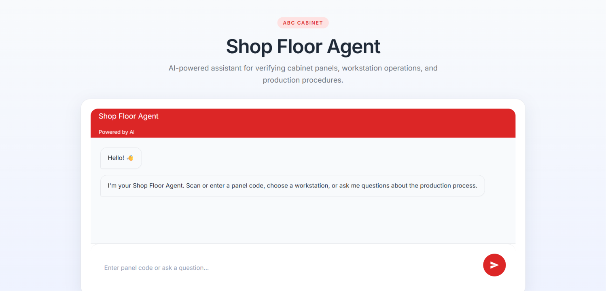
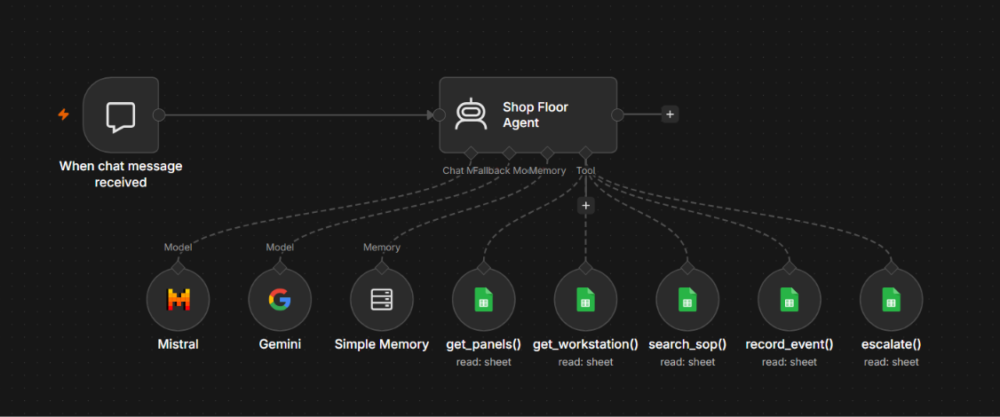

# Shop Floor Agent




## Project Information

| Item | Value |
|------|------|
| **🌐 Live Demo (Recommended)** | **[https://shop-floor.r4yv.tech/](https://shop-floor.r4yv.tech/)** - test the application immediately without setup |
| **🎥 Demo Video** | [View the demo on Google Drive](https://drive.google.com/file/d/1hyBFFNtVItotwvUJ3yomwNTrqEL0qgCh/view?usp=sharing) |
| **📂 Repository / Source Code** | [github.com/rayvin04/shop-floor-ai-rayvin-gianan](https://github.com/rayvin04/shop-floor-ai-rayvin-gianan) |
| **LLM Provider** | Google Gemini 2.5 Flash + Mistral AI |
| **Agent Implementation Approach** | n8n AI Agent with Tool Calling |
| **Data Storage Approach** | Structured Mock Data using Google Sheets |
| **Approximate Time Spent** | ~2 hours |

## Project Overview

Shop Floor Agent is a prototype AI assistant developed for a Junior AI Engineer technical assessment. It helps manufacturing operators verify cabinet panels, validate workstation assignments, retrieve Standard Operating Procedures (SOPs), and escalate unresolved issues.

All manufacturing information comes from structured mock data stored in Google Sheets instead of being generated by the LLM. The agent uses tool calling to retrieve grounded information before interpreting and presenting a response.

## Highlights

- 🤖 AI Agent with Tool Calling
- 📋 Structured Mock Data using Google Sheets
- ⚡ Workflow Automation with n8n
- 💬 Modern Chat UI built with Lovable
- 🧠 Powered by Google Gemini and Mistral AI
- 🔍 Grounded Responses (No Hallucination)
- 📈 Simple Agent Trace for Transparency
- 🚀 Live Demo Available

## Tech Stack

| Component | Technology | Purpose |
| --- | --- | --- |
| Frontend | Lovable | Provides the responsive chat interface for manufacturing operators. |
| Workflow Automation | n8n | Orchestrates the workflow, agent, tools, and data retrieval. |
| AI Agent | n8n AI Agent | Interprets requests and selects the appropriate tool. |
| LLM Provider | Google Gemini 2.5 Flash + Mistral AI | Provides language understanding and response generation. |
| Structured Mock Data | Google Sheets | Stores mock panel, workstation, and SOP data. |
| Workflow Hosting | Heroku | Hosts the n8n workflow and webhook endpoint. |
| Frontend Deployment | Vercel | Deploys the operator-facing frontend. |
| Version Control | GitHub | Stores the source code and workflow assets. |

## Architecture

```text
Lovable UI
    ↓
Embedded n8n Chat
    ↓
n8n Workflow
    ↓
AI Agent
    ↓
Tools
    ↓
Google Sheets
```

The agent uses these tools to retrieve and record manufacturing information:

- `get_panel`
- `get_workstation`
- `search_sop`
- `escalate_to_supervisor`
- `record_event`

## Available AI Tools

| Tool | Description |
|------|-------------|
| **get_panel** | Retrieves panel information from the structured Google Sheets dataset. |
| **get_workstation** | Retrieves workstation details and validates whether a panel is at the correct workstation. |
| **search_sop** | Retrieves manufacturing procedures and standard operating instructions. |
| **escalate_to_supervisor** | Escalates unresolved manufacturing issues to a supervisor. |
| **record_event** | Records interactions internally for audit and history purposes (not shown to users). |

## n8n Workflow

n8n orchestrates the AI agent, tool calling, and structured data retrieval. The complete n8n workflow JSON is included in the repository root, allowing reviewers to import and run the workflow in their own n8n instance if they wish to test it locally.



## Features

- Panel verification
- Workstation validation
- SOP retrieval
- Supervisor escalation
- Grounded AI responses
- AI Tool Calling
- Agent Trace
- Structured Mock Data
- Clean responsive chat interface

## Project Structure

```text
/
├── README.md
├── shop-floor-agent.png
├── shop-floor-n8n.png
├── workflow.json
└── frontend/
```

## Setup

1. Clone the repository.
2. Import the included `workflow.json` into n8n.
3. Configure Google Gemini and Mistral AI credentials.
4. Connect the Google Sheets data source.
5. Deploy or run the frontend.
6. Start and activate the n8n workflow.

## Required Test Results

| Scenario | User Prompt | Expected AI Response |
| --- | --- | --- |
| ✅ **Correct Workstation** | > I have panel P-1001 and I'm currently at workstation EDGE-01. Can you verify if I'm at the correct workstation and tell me what I should do next? | Confirms EDGE-01 is correct, instructs the operator to perform Edge Banding, and displays an Agent Trace showing `get_panel` and `get_workstation`. |
| ✅ **Wrong Workstation** | > I'm processing panel P-1003 at workstation EDGE-01. Is this the correct workstation? | Explains that P-1003 requires Drilling at DRILL-01, informs the user that EDGE-01 is incorrect, and displays an Agent Trace showing `get_panel` and `get_workstation`. |
| ✅ **Unsupported Question / No Hallucination** | > What is n8n? | Politely refuses because the question is unrelated to manufacturing and does not fabricate an answer. |
| ✅ **Unknown Panel** | > Can you check panel P-1027? | Reports that panel P-1027 was not found and advises verifying the panel code or contacting a supervisor. |
| ✅ **Supervisor Escalation** | > Please escalate this issue to a supervisor. The panel label is damaged and I cannot verify whether this is panel P-1002. | Escalates the issue and displays an Agent Trace containing `escalate_to_supervisor`. |

## Brief Technical Questions

### 1. How does the agent decide which tool to call?

The AI agent analyzes the user's request and selects the appropriate tool based on its description. It retrieves the required information before generating a response.

### 2. What tools are available to the agent?

- get_panel
- get_workstation
- search_sop
- escalate_to_supervisor
- record_event

### 3. What information comes from structured data rather than the LLM?

Panel information, cabinet details, dimensions, materials, required operations, workstation information, and SOP instructions are retrieved from structured Google Sheets. The LLM only interprets and presents this information.

### 4. How do you prevent unsupported or invented answers?

The agent only answers using information returned by its tools. If the requested information cannot be found, it clearly informs the user instead of generating unsupported answers.

### 5. What happens when a tool or LLM call fails?

If a tool does not return the required information or the request cannot be completed, the agent informs the user that it cannot verify the request and recommends the appropriate next step, such as checking the panel code or contacting a supervisor.

### 6. If you had one more day, what would you improve first and why?

I would improve the interaction logging and audit trail. While the prototype already performs real tool calls and displays an Agent Trace, I would make every manufacturing interaction automatically logged, including timestamps, actions taken, and supervisor escalations. This would make it easier to trace issues, debug workflow problems, and review historical interactions.

## Notes

The solution intentionally keeps the architecture simple. The primary objective was to demonstrate grounded AI, structured mock data, and AI tool calling. The implementation prioritizes reliability and clarity over unnecessary complexity.

## GitHub Repository Topics

These recommended GitHub repository topics can improve project discoverability:

```text
n8n
ai-agent
lovable
google-gemini
mistral-ai
google-sheets
workflow-automation
tool-calling
chatbot
manufacturing
shop-floor
artificial-intelligence
automation
vercel
heroku
```

> Developed as part of a Junior AI Engineer technical assessment using **n8n**, **Lovable**, **Google Gemini**, **Mistral AI**, and **Google Sheets** to demonstrate grounded AI, structured data retrieval, AI tool calling, and workflow automation.
